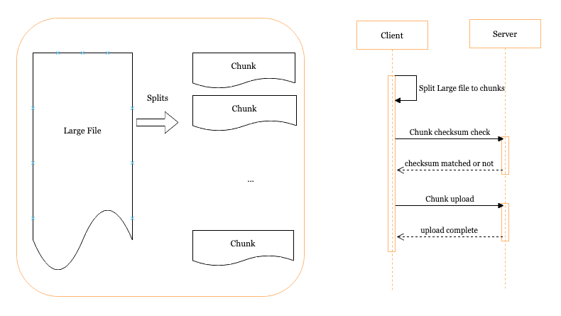

# goup

Utility to upload large files through HTTP.

This is done by splitting large file into small chunks; whenever the upload of a chunk fails, uploading is retried until
the procedure completes. This allows uploads to automatically resume uploading after a network connection is lost, or
program restarting either locally or to the server.



### Usage

```shell
$ goup -h                                                       
Usage of goup:
  -b string bearer token for client or server, auto for server to generate a random one
  -c int chunk size  for client, unit MB (default 10)
  -f string upload file path for client
  -p int listening port for server
  -r string rename to another filename
  -u string server upload url for client to connect to
  -v bool show version
  -init bool create init ctl shell script
```

1. Installation `go install https://github.com/bingoohuang/goup`
1. At the server, `goup -p 2110`
2. At the client, `goup -u http://a.b.c:2110/ -f 246.png`

```sh
$ goup -p 2110
2022/01/20 17:40:20 Listening on 2110
2022/01/20 17:40:24 recieved file 246.png with sessionID CF79FC6EA88010E1, range bytes 0-10485760/96894303
2022/01/20 17:40:24 recieved file 246.png with sessionID CF79FC6EA88010E1, range bytes 10485760-20971520/96894303
2022/01/20 17:40:24 recieved file 246.png with sessionID CF79FC6EA88010E1, range bytes 20971520-31457280/96894303
2022/01/20 17:40:24 recieved file 246.png with sessionID CF79FC6EA88010E1, range bytes 31457280-41943040/96894303
2022/01/20 17:40:24 recieved file 246.png with sessionID CF79FC6EA88010E1, range bytes 41943040-52428800/96894303
2022/01/20 17:40:47 recieved file 246.png with sessionID 46CB3E789B10DDB5, range bytes 52428800-62914560/96894303
2022/01/20 17:40:47 recieved file 246.png with sessionID 46CB3E789B10DDB5, range bytes 62914560-73400320/96894303
2022/01/20 17:40:47 recieved file 246.png with sessionID 46CB3E789B10DDB5, range bytes 73400320-83886080/96894303
2022/01/20 17:40:47 recieved file 246.png with sessionID 46CB3E789B10DDB5, range bytes 83886080-94371840/96894303
2022/01/20 17:40:47 recieved file 246.png with sessionID 46CB3E789B10DDB5, range bytes 94371840-96894303/96894303

$ md5sum .goup-files/246.png 
5849c383ab841e539673d50a49c3f39a  .goup-files/aDrive.dmg
$ sha256sum .goup-files/246.png
32677ca3a5b19ee5590a75d423b3fc2d754bd76900d50c26e0525681985189f8  .goup-files/aDrive.dmg
```

```sh
$ goup -u http://127.0.0.1:2110/ -f 246.png                           
2022/01/20 17:44:08 Upload B821C49E4B1CBDBD started
40.00 MiB / 92.41 MiB [-------------------------------------------------------------------->__________________________________________________________________________________________] 43.29% ? p/s^C
$ diff -s /Users/bingoobjca/Downloads/goup/.goup-files/246.png 246.png
Binary files /Users/bingoobjca/Downloads/goup/.goup-files/246.png and 246.png differ
$ goup -u http://127.0.0.1:2110/ -f 246.png                           
2022/01/20 17:44:21 Upload 4739FE47D18ADF7F started
92.41 MiB / 92.41 MiB [-----------------------------------------------------------------------------------------------------------------------------------------------------] 100.00% 121.54 MiB p/s
2022/01/20 17:44:21 Upload 4739FE47D18ADF7F completed
$ diff -s /Users/bingoobjca/Downloads/goup/.goup-files/246.png 246.png
Files /Users/bingoobjca/Downloads/goup/.goup-files/246.png and 246.png are identical
$ md5 246.png
MD5 (aDrive.dmg) = 5849c383ab841e539673d50a49c3f39a
$ sha256sum 246.png
32677ca3a5b19ee5590a75d423b3fc2d754bd76900d50c26e0525681985189f8  246.png
```

As you can see, even if you terminate the client uploading, you can resume uploading from last breakpoint.

